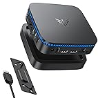

# Homelab

This is collection of configuration files and ansible playbooks that will serve both as setup and documentation of my Homelab infrastructure.

This is a work in progress and I'd like to continue adding a lot of features and/or services in the future.

## Hardware

| Instance | Purpose |  |
|----------|----------|----------|
| Home server    | Serve personal content (such as shows and movies) |  |
| Personal VPS    | Be a 24/7 instance with always-available services |  |
