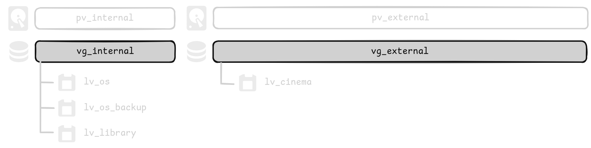
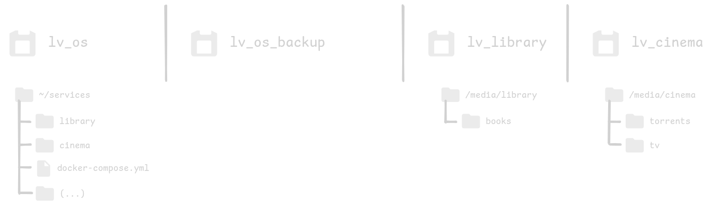
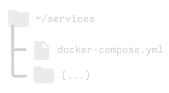
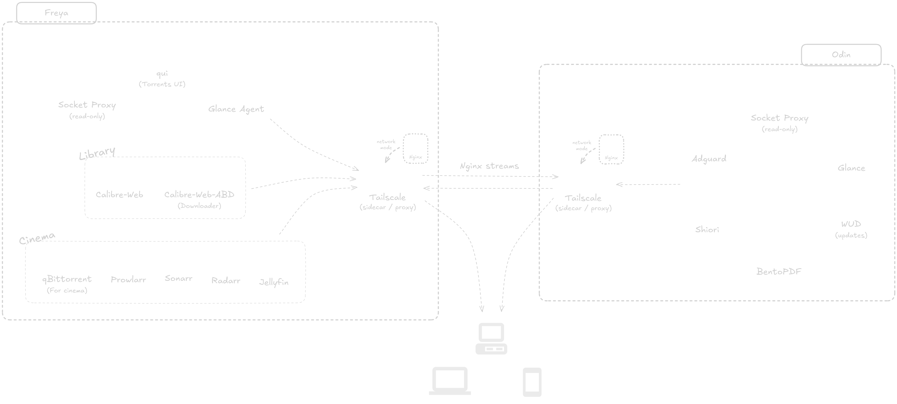

# Homelab

This is collection of configuration files and ansible playbooks that will serve both as setup and documentation of my Homelab infrastructure.

This is a *work in progress* and I'd like to continue adding a lot of features and/or services in the future.

## Design philosophy

Each instance must comply with these rules:

1. No personal information.
2. Information must be volatile.
3. Infrastructure must be declarative and reproducible.

## Hardware

| Instance | Codename | Purpose | Size |
|----------|----------|----------|----------|
| Home server | **Freya** | Media content server | Intel 12th Gen N100, 16GB RAM, 512GB M.2 SSD, 2TB SATA SSD |
| Personal VPS | **Odin** | Tools and services | 1 OCPU, 1GB RAM |
| VPS | **Magni** | Hosting for my website | 1 OCPU, 1GB RAM |

## Filesystem

### Freya

**OS:** Debian

#### LVM



- `pv_internal` is designated for the internal SSD, whereas `pv_external` is allocated for the external SSD. The `lv_cinema` volume encompasses the entire disk, as I prefer to keep shows and movies off the internal SSD to avoid the frequent write cycle burden.

- `lv_os` contains an OS for headless use, while `lv_os_backup` contains the same OS, but with a graphical session.

- `lv_library` is designed to hold my library of books and `lv_cinema` my shows and movies.

#### Volumes



- `lv_os` also contains the configuration files for the Docker services used. Such files are separated by the type of service (`library` or `cinema`). If this separation does not apply, then the files just live at `~/services`.

- `lv_library` is mapped at `/media/library`. Books are inside `books`.

- `lv_cinema` is mapped at `/media/cinema`. Downloading and seeding torrents are inside `torrents`, while shows and movies are inside `tv`.

### Odin

**OS:** Ubuntu



In the user's home directory, all configuration files are inside `~/services` directory.

### Magni

_Currently not in use._

## Design



Both instances are connected to my Tailnet using a Tailscale Docker container as a sidecar. It is bound to a Nginx container that handles the reverse proxy functionality.

Services in different instances can communicate with each other using **Nginx streams**.

## Setup

The ansible playbooks assume the machine they are being run on can connect via ssh just with their hostname. For instance, `ssh odin` should work. The user to login as **SHOULD NOT** be root. Also, authentication must be done with a ssh key, otherwise you will be locked out.

1. Clone this repo and navigate to the root directory.

**NOTE:** Make sure to fill the env vars wherever they are need. Inside some dirs they is a `.env.example` file. Copy it to an `.env` file in the same dir and fill it. Same with `secrets.example.yml`.

2. With Python installed, create a virtual environment with:

```bash
python -m venv .venv
```

3. Activate the virtual environment. Example:

```bash
source .venv/bin/activate.fish
```

4. Install ansible:

```bash
pip install ansible
```

Check if everything is okay with:

```bash
which ansible
```

5. (OPTIONAL) Navigate to `[machine]/ansible` and do this to check syntax:

```bash
ansible-playbook --syntax-check setup.yml
```

6. Run the initial setup part as root (this is important, because at some point, is it necessary to log out and log back in)

```bash
ansible-playbook --ask-become-pass setup.yml --tags root
```

7. Run the rest with:

```bash
ansible-playbook --ask-become-pass setup.yml --skip-tags root
```

#

<div>
    
    
    
    
</div>
